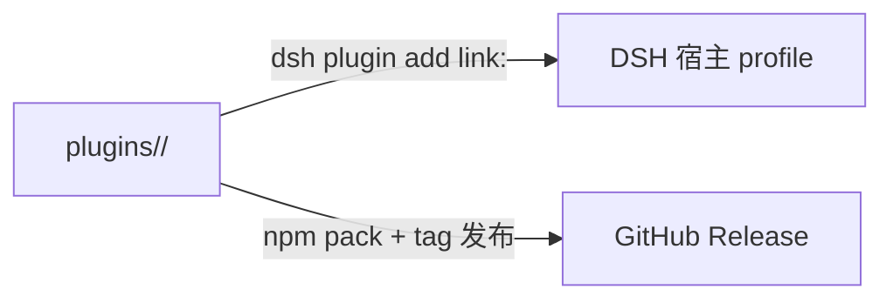

# 架构总览

## 仓库形态：多插件目录

本仓库是**轻量多插件目录**（非 workspace monorepo）。每个插件是 `plugins/<name>/` 下的**自包含 Cordis bundle**：拥有自己的 `package.json`、`cordis.patch.yml`、README、LICENSE、CHANGELOG，可独立安装、独立发布、独立拆仓。

## 插件两端架构

| 端            | 文件            | 运行位置      | 职责                                                                                                             |
| ------------- | --------------- | ------------- | ---------------------------------------------------------------------------------------------------------------- |
| **Server 端** | `lib/index.js`  | DSH Node 进程 | 事件监听（`ctx.on`）、HTTP 路由（`webServer.register`）、持久化（`$DSH_HOME` 下 JSON）                           |
| **Client 端** | `lib/client.js` | 浏览器        | 经宿主原生扩展点（`ctx.sidebarRightTabs` + `ctx.slots`）注册侧边栏页签，经 `ctx.documentPreviews` 注册文件预览器 |

关键约定：

- Server 端导出 `{ name, inject, apply }`；client 端使用 `window.__ModuleLoader__.load({ id, factory })` 格式（**非 Node ESM**）。
- 通信方向：client → server 走 HTTP（插件自有 `/api` 路由）；server → client 通过事件或 client 轮询。
- 安全：插件 HTTP 路由 handler 需先做 **loopback 信任围栏**（403 拒绝非本机来源）。
- 生命周期：所有副作用（事件监听、路由注册、页签注册、定时器）必须包在 `ctx.effect()` 中并返回 disposer，保证 HMR/禁用无残留。

## 目录规范要点

- 包名 `dsh-<功能>`，**目录名 = 包名**，无 scope。
- client 注册的 tab/viewer id 统一 `包名:xxx` 前缀，不与内置 id 冲突。
- 根 `.gitignore` 统一覆盖 `node_modules/`、`.DS_Store` 等，插件无需独立 `.gitignore`；术语统一用 **Server 端 / Client 端**（见 [术语表](../术语表.md)）。

## 相关文档

→ [项目简介](项目简介.md) · [快速上手](快速上手.md) · [插件开发技能](../插件开发技能/概述.md)
