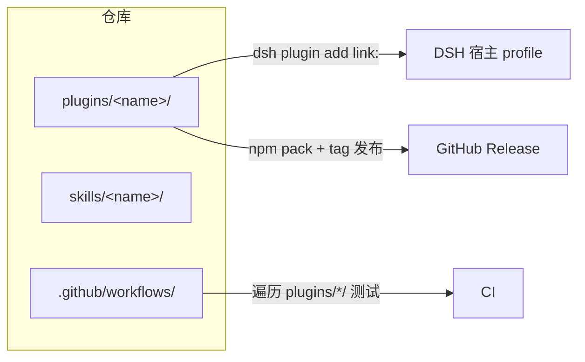
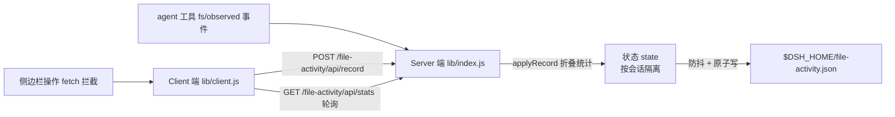
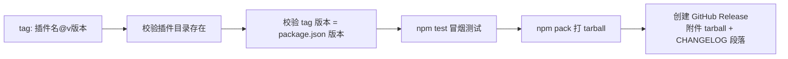

# 架构总览

## 仓库形态：多插件目录

本仓库是**轻量多插件目录**（非 workspace monorepo）。每个插件是 `plugins/<name>/` 下的**自包含 Cordis bundle**：拥有自己的 `package.json`、`cordis.patch.yml`、README、LICENSE、CHANGELOG，可独立安装、独立发布、独立拆仓。

## 插件两端架构

一个插件通常由两端组成，代码在 `plugins/<name>/lib/` 下：

| 端            | 文件            | 运行位置      | 职责                                                                                                                                                   |
| ------------- | --------------- | ------------- | ------------------------------------------------------------------------------------------------------------------------------------------------------ |
| **Server 端** | `lib/index.js`  | DSH Node 进程 | 事件监听（`ctx.on`）、HTTP 路由（`webServer.register`）、持久化（`$DSH_HOME` 下 JSON）                                                                 |
| **Client 端** | `lib/client.js` | 浏览器        | 通过宿主原生扩展点（`ctx.sidebarRightTabs` + `ctx.slots`）注册侧边栏页签；`dsh-file-activity` 仍用第三方 `ctx.betterSidebar`（预览器/浮窗，批 2 排期） |

- Server 端导出 `{ name, inject, apply }`；client 端使用 `window.__ModuleLoader__.load({ id, factory })` 格式（**非 Node ESM**）。
- 通信方向：client → server 走 HTTP（`/sidebar/api/*`、插件自有 `/api` 路由）；server → client 通过事件或 client 轮询。
- 安全：插件 HTTP 路由 handler 需先做 **loopback 信任围栏**（`fence()`，403 拒绝非本机来源）。
- 生命周期：所有副作用（事件监听、路由注册、页签注册、定时器）必须包在 `ctx.effect()` 中，返回 disposer，保证 HMR/禁用无残留。

## 数据流示例（dsh-file-activity）

## CI 与发布流程

**CI（`.github/workflows/ci.yml`）**：push/PR 触发 → 遍历 `plugins/*/` → `node --check` 语法检查 + `npm test` 冒烟测试。

**Release（`.github/workflows/release.yml`）**：push `*@v*` tag 触发：

## 目录规范要点

- 包名 `dsh-<功能>`，**目录名 = 包名**，无 scope。
- client 注册的 tab/viewer id 统一 `包名:xxx` 前缀，不与内置 id 冲突。
- 根 `.gitignore` 统一覆盖 `node_modules/`、`.DS_Store`、`.dsh-vision-toolkit/` 等，插件无需独立 .gitignore。
- 术语统一：**Server 端 / Client 端**（禁止写 "Host 半"）。

## 相关文档

→ [项目简介](项目简介.md) · [快速上手](快速上手.md) · [插件开发技能](../插件开发技能/概述.md)
