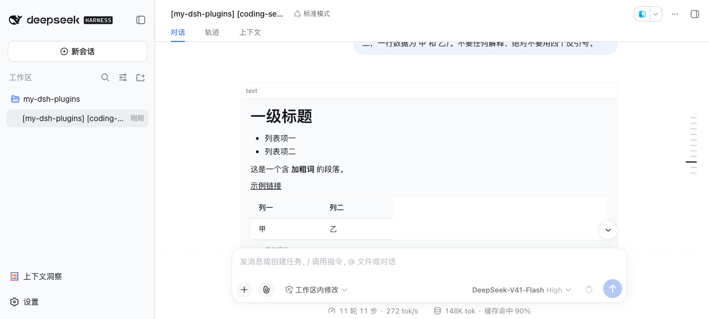

# dsh-md-render

[](https://github.com/topics/dsh)

<div align="center">
  
</div>

**对话 Markdown 渲染补位插件（精简版）**：GFM 表格（含对齐与宽表格横向滚动）、公式（KaTeX）、代码块（高亮 / 语言标签 / 行号 / 复制）已由宿主官方 `MarkdownText`（`@deepseek-ai/dsh-client-ui-primitives`，0.1.7-rc.2 起内置）提供，**本插件不再自实现任何 markdown 渲染**，只保留官方没覆盖的那几件事：把宿主**渲染为纯文本**的 markdown 交给官方渲染器、整段复制、统一 `MarkdownView` 导出、设置面板，以及官方 GFM 不认的两种表格写法容错。

## 功能（只保留真增量）

- **text 围栏块按 markdown 渲染**：语言标记为 `text` / `plaintext` / `txt` 的围栏块，块内内容交给官方渲染器按 markdown 渲染（标题 / 列表 / 表格 / 公式等能力与宿主消息完全一致），每块带**独立**的「查看原文」切换；其他标记（`js` / `ts` / `json` / `bash` …）与无标记块**完全不变**。
- **上下文注入块渲染**：宿主把上下文注入正文（**子 agent 回传消息**、AGENTS.md 等）渲染为纯文本 `pre[data-context-text]`；本插件在 DOM 层把这类块交给官方渲染器渲染，原文节点保留并置 `hidden`。
- **整段 markdown 复制**：官方只有代码块复制；`MarkdownView` 容器带整段复制按钮（复制内容排除代码块 banner 与按钮文案），流式渲染中不显示。
- **统一 `MarkdownView`**：`require('dsh-md-render').MarkdownView`（props `{ text: string }`）＝ 官方渲染 + 表格容错 + 整段复制，供本仓其他插件使用（`dsh-my-plugin-manager` 的 README 预览）。
- **非标准表格容错**：官方 GFM **不认**的两种写法先规范化再交给官方渲染器 —— ① 分隔行完全没有管道符（`a | b` 后跟 `---`，GFM 当 setext 标题）；② 分隔行单元格数与表头不等（GFM 整段不识别）。**GFM 本来就接受的写法一律不动**（无首尾管道符、紧凑 `---|---`、单横线 `-|-`、表格前有普通段落文本、数据行列数不等、逐列对齐标记 —— 逐条实测证据见 `test/table-normalize.mjs`）。
- **增强开关面板**：全部保留能力可在 设置 → 插件 → 渲染 页签可视化编辑，保存即生效、重启不丢。
- **流式安全**：流式中的块等内容稳定再渲染（`[data-streaming]` 门控），重扫幂等（签名未变不重建），宿主重渲染后自愈。

## 配置

写入 `cordis.patch.yml` 对应插件行的 `config`（设置页保存后同样落盘到 profile patch 文件）：

| 配置键               | 默认   | 作用                                                                 |
| -------------------- | ------ | -------------------------------------------------------------------- |
| `copyButton`         | `true` | 整段 markdown 复制按钮（`MarkdownView` 容器）                        |
| `textFenceMarkdown`  | `true` | `text` / `plaintext` / `txt` 围栏块按 markdown 渲染 + 查看原文切换 |
| `contextMarkdown`    | `true` | `pre[data-context-text]` 上下文注入块按 markdown 渲染                |

> 开关须为布尔值，非法 / 缺省保持默认；配置变更热生效，无需重启。

### 0.3.0 迁移说明（开关下线）

自实现渲染下线后，下列旧开关**已不存在**（对应能力由官方内置，无需开关）：`syntaxHighlight`、`languageLabel`、`lineNumbers`、`taskList`、`strikethrough`、`image`、`nestedList`、`mathStructures`、`tableSort`、`tableFold`、`copyButtonPosition`、`codeTheme`。patch 文件里的旧键**保留无害**（被忽略，不会报错）。

## 安装

> 💡 **npm 安装（普通用户推荐）**：`dsh plugin --profile web add dsh-md-render --trust-lockfile`——无需克隆本仓库；以下 link 方式供本仓库开发者使用。

```bash
# 1) 克隆本仓库（任意目录）
git clone https://github.com/baosfeng/my-dsh-plugins.git
# 2) 以本地 link 方式安装（将 <仓库路径> 替换为上面的克隆目录）
dsh plugin --profile web add link:<仓库路径>/plugins/dsh-md-render
```

装完后**重启 `dsh web`**（bundle 层在启动时组合），再硬刷新浏览器。

> 依赖面：产物只 `require` 平台 seed 模块（`react` / `react-dom/client` / `@deepseek-ai/dsh-client-ui-primitives`），**零安装零 external 声明**；官方组件不可用时走真降级（`MarkdownView` 落 `<pre>`，注入点不动宿主 DOM）。

## 公共 API 契约（semver 承诺）

对外唯一承诺的 API 是 **`MarkdownView`**：`require('dsh-md-render').MarkdownView` 存在且为 React 组件，props 为 `{ text: string }`（额外 props 被忽略，非字符串降级为文本）；bundle id 为 `dsh-md-render`。移除 / 改名 / 必需 props 变更 = major。

**本插件自有 DOM 契约**（跨插件可见；类名或层级变更 = major）：

| 类名 / 属性                                                                          | 含义                                        |
| ------------------------------------------------------------------------------------ | ------------------------------------------- |
| `tzx-md`                                                                             | `MarkdownView` 包裹容器（官方渲染内容在内） |
| `dsh-md-render-copy` / `dsh-md-render-copy-done`                                     | 整段复制按钮 / 复制成功态                    |
| `dsh-md-render-text-md` / `dsh-md-render-text-toggle`                                | text 围栏块的渲染容器 / 「查看原文」按钮     |
| `dsh-md-render-context-md`（`data-dsh-md-render-context-body`）                       | 上下文注入块的渲染容器                      |
| `data-dsh-md-render-text-view`（`markdown` \| `source`）                             | text 围栏块的视图状态（每块独立）            |
| `data-dsh-md-render-text-sig` / `data-signature`                                     | 幂等签名（内容未变不重建）                   |
| `dsh-md-render-fallback`                                                              | 官方组件不可用时 `MarkdownView` 的 `<pre>` 兜底 |

**渲染内容的 DOM 由官方 `MarkdownText` 决定**（不属于本插件的契约面）：表格 / 公式 / 代码块的类名与结构以 `@deepseek-ai/dsh-client-ui-primitives` 为准。

其余 exports（`normalizeTables` / `renderMarkdownInto` / `applyContextMarkdown` / `applyTextMarkdown` 等）属内部实现面，随重构变动，下游不得依赖。契约由 `test/markdown-view-contract.mjs` 钉住；text 围栏块由 `test/text-fence-markdown.mjs`、上下文块由 `test/context-markdown.mjs` 钉住；改契约需同步本 README 与 `CHANGELOG.md`。

## 已知限制

- **围栏语言识别**依赖官方 `CodeBlock` 的 React props（fiber `memoizedProps.lang`，官方 DOM 里没有 `language-xxx` class）；取不到时回退 `code.language-xxx` / banner infostring，仍取不到则保持宿主原样（不报错、不改 DOM）。
- **官方组件不可用**（极旧或裁剪宿主）：`MarkdownView` 落 `<pre>` 兜底；两个注入点保持宿主纯文本渲染。
- **单块超长**保持宿主原样：text 围栏块 > 10 万字符、上下文注入块 > 20 万字符。
- **表格容错只覆盖上述两种写法**：纯空格分隔、缺分隔行等「不是表格」的写法不会渲染为表格（官方 GFM 与旧实现同样不接受）。

## 相关文档

→ [md 渲染模块文档](../../docs/md渲染/概述.md) · [CHANGELOG](CHANGELOG.md)
