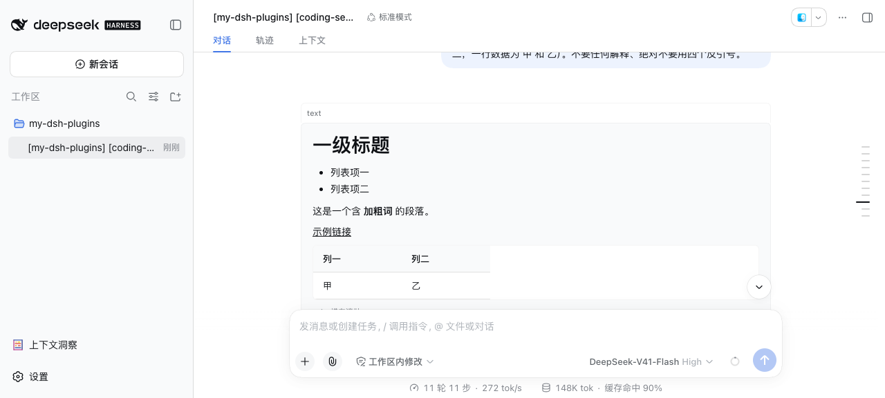

# dsh-md-render

[](https://github.com/topics/dsh)

<div align="center">
  
</div>

**对话 Markdown 渲染补位插件**：GFM 表格（含对齐与宽表格横向滚动）、公式（KaTeX）、代码块（高亮 / 语言标签 / 行号 / 复制）由宿主官方 `MarkdownText`（`@deepseek-ai/dsh-client-ui-primitives`）提供，**本插件不自实现任何 markdown 渲染**，只补官方没覆盖的内容：把宿主**渲染为纯文本**的 markdown 交给官方渲染器、mermaid 图表卡片、思考块默认展开、整段复制、统一 `MarkdownView` 导出、设置面板、官方 GFM 不认的两种表格写法容错。

> 合并包：原 `dsh-think-zh-expand`（思考块）与 `dsh-mermaid-render`（图表）已并入本插件，两个旧包已下线，迁移见 [破坏性变更与迁移](#破坏性变更与迁移)。

## 功能（只保留真增量）

- **text 围栏块按 markdown 渲染**：语言标记为 `text` / `plaintext` / `txt` 的围栏块，块内内容交给官方渲染器按 markdown 渲染，每块带**独立**的「查看原文」切换；其他标记（`js` / `ts` / `json` / `bash` …）与无标记块**完全不变**。
- **上下文注入块渲染**：宿主把上下文注入正文（**子 agent 回传消息**、AGENTS.md 等）渲染为纯文本 `pre[data-context-text]`；本插件在 DOM 层把这类块交给官方渲染器，原文节点保留并置 `hidden`。
- **mermaid 图表卡片**：`mermaid` / `mmd` 围栏块渲染为图表卡片（预览 / 代码切换、导出 PNG / SVG）；渲染失败时卡片显示错误原因 + 重试 + **原始源码**（绝不静默丢内容）。引擎 `assets/mermaid-10.9.3.min.js` 由 host 半静态托管，client 首次渲染时按需 fetch，**不内联进 bundle**。
- **思考块默认展开**：对官方折叠行派发**一次真实 click**，展开动画 / 结构 / a11y 全走官方；用户手动折叠后不再干预。
- **整段 markdown 复制**：官方只有代码块复制；`MarkdownView` 容器带整段复制按钮（复制内容排除代码块 banner 与按钮文案），流式渲染中不显示。
- **统一 `MarkdownView`**：`require('dsh-md-render').MarkdownView`（props `{ text: string }`）＝ 官方渲染 + 表格容错 + 整段复制，供本仓其他插件使用。
- **非标准表格容错**：官方 GFM **不认**的两种写法先规范化再交给官方渲染器 —— ① 分隔行完全没有管道符（`a | b` 后跟 `---`，GFM 当 setext 标题）；② 分隔行单元格数与表头不等（GFM 整段不识别）。**GFM 本来就接受的写法一律不动**（逐条实测证据见 `test/table-normalize.mjs`）。
- **增强开关面板**：全部能力在 设置 → 插件 → 渲染 页签单 tab 三分组可视化编辑，保存即生效、重启不丢。
- **流式安全**：流式中的块等内容稳定再渲染（`[data-streaming]` 门控 + 400ms 稳定窗口），重扫幂等（签名未变不重建），宿主重渲染后自愈。

## 配置

写入 `cordis.patch.yml` 对应插件行（id `md-render`）的 `config`；设置页保存后同样落盘到 profile patch 文件：

| 配置键                        | 默认   | 作用                                                          |
| ----------------------------- | ------ | ------------------------------------------------------------- |
| `markdown.copyButton`         | `true` | 整段 markdown 复制按钮（`MarkdownView` 容器）                  |
| `markdown.textFenceMarkdown`  | `true` | `text` / `plaintext` / `txt` 围栏块按 markdown 渲染 + 查看原文 |
| `markdown.contextMarkdown`    | `true` | `pre[data-context-text]` 上下文注入块按 markdown 渲染          |
| `thinking.defaultExpanded`    | `true` | 思考块默认展开（严格布尔，缺失 / 非法回退 true）                |
| `mermaid.injectPrompt`        | `true` | 注入 mermaid 能力说明 section（仅显式 `false` 关）              |
| `mermaid.render`              | `true` | `mermaid` / `mmd` 代码块渲染为图表卡片                        |

> `markdown.*` / `mermaid.*` 是「默认开」语义（仅显式 `false` 关）；`thinking.defaultExpanded` 是严格布尔。非法 / 未知键忽略；配置变更热生效，无需重启。

**旧扁平键读兼容**：合并前 `dsh-md-render` 把开关写在 patch 行**顶层**（`copyButton` / `textFenceMarkdown` / `contextMarkdown`），老用户 profile 里已经落盘；读取时顶层旧键映射进对应段（**段内键优先**），**写入一律新结构**。旧 `think-zh-expand` / `mermaid-render` 的顶层 `defaultExpanded` / `injectPrompt` 同样读兼容。

## 路由（host ↔ client 内部契约）

| 路径                                        | 方法       | 用途                                |
| ------------------------------------------- | ---------- | ----------------------------------- |
| `/md-render/api/config`                     | GET / PUT  | 配置读写（归一 + 合并行内已有键后落盘） |
| `/md-render/assets/mermaid-10.9.3.min.js`   | GET / HEAD | mermaid 引擎静态资源（ETag / 304 / 405） |

两条都是包内 host↔client 私有契约（host 与 client 同包同版本发布，无仓库外消费者），路径来自单一真源 `src/routes/paths.ts`、构建期注入 client 产物，由 `test/route-single-source.mjs` 钉住两侧一致。请求先过 loopback 信任围栏（非本机 → 403）。

## 破坏性变更与迁移

| 变更                                                    | 迁移动作                                                                                                             |
| ------------------------------------------------------- | -------------------------------------------------------------------------------------------------------------------- |
| `dsh-think-zh-expand` / `dsh-mermaid-render` 包下线     | 从 profile 的 bundles / roster 删掉 `- id: think-zh-expand`、`- id: mermaid-render` 两行（残留会让 loader 指向不存在的包而启动报错），改用本插件 |
| 旧路由 `/md/api`、`/think-zh-expand/api`、`/mermaid-render/api`、`/mermaid-render/assets/*` | 不兼容、直接 404：改用 `/md-render/api`、`/md-render/assets`（仅包内契约，无外部消费者）                            |
| 设置页 3 个 tab → 1 个「渲染」tab（三分组）                | 无需动作                                                                                                             |
| 配置键扁平 → 命名空间（`markdown.*` / `thinking.*` / `mermaid.*`） | **读取兼容**，旧键继续生效；下次保存起落盘为新结构                                                                   |
| 自实现渲染开关（0.3.0 起）                                | `syntaxHighlight` / `languageLabel` / `lineNumbers` / `taskList` / `strikethrough` / `image` / `nestedList` / `mathStructures` / `tableSort` / `tableFold` / `copyButtonPosition` / `codeTheme` 已不存在（能力由官方内置），patch 里的旧键**保留无害**（被忽略） |

system-prompt section 名保持 `dsh-mermaid-render`（宿主按 name 去重），**非破坏性**；中文思考指令不在此注入，由 dsh-my-memory 的「全局提示词」提供。

## 安装

> 💡 **npm 安装（普通用户推荐）**：`dsh plugin --profile web add dsh-md-render --trust-lockfile`——无需克隆本仓库；以下 link 方式供本仓库开发者使用。

```bash
# 1) 克隆本仓库（任意目录）
git clone https://github.com/baosfeng/my-dsh-plugins.git
# 2) 以本地 link 方式安装（将 <仓库路径> 替换为上面的克隆目录）
dsh plugin --profile web add link:<仓库路径>/plugins/dsh-md-render
```

装完后**重启 `dsh web`**（bundle 层在启动时组合），再硬刷新浏览器。

> 依赖面：产物只 `require` 平台 seed 模块（`react` / `react-dom/client` / `@deepseek-ai/dsh-client-ui-primitives`），**零安装零 external 声明**；官方组件不可用时走真降级（`MarkdownView` 落 `<pre>`，注入点不动宿主 DOM）。

## 公共 API 契约（semver 承诺）

对外唯一承诺的 API 是 **`MarkdownView`**：`require('dsh-md-render').MarkdownView` 存在且为 React 组件，props 为 `{ text: string }`（额外 props 被忽略，非字符串降级为文本）；bundle id 为 `dsh-md-render`。移除 / 改名 / 必需 props 变更 = major。

**本插件自有 DOM 契约**（跨插件可见；类名或层级变更 = major）：

| 类名 / 属性                                                                              | 含义                                          |
| ---------------------------------------------------------------------------------------- | --------------------------------------------- |
| `tzx-md`                                                                                 | `MarkdownView` 包裹容器（官方渲染内容在内）   |
| `dsh-md-render-copy` / `dsh-md-render-copy-done`                                        | 整段复制按钮 / 复制成功态                      |
| `dsh-md-render-text-md` / `dsh-md-render-text-toggle`                                   | text 围栏块的渲染容器 / 「查看原文」按钮       |
| `dsh-md-render-context-md`（`data-dsh-md-render-context-body`）                           | 上下文注入块的渲染容器                        |
| `dsh-md-render-mermaid-host`（`data-dsh-md-render-mermaid` / `-state` / `-view`）       | mermaid 卡片 host / 状态机标记                |
| `data-dsh-md-render-text-view`（`markdown` \| `source`）                               | text 围栏块的视图状态（每块独立）              |
| `data-dsh-md-render-text-sig` / `data-signature`                                        | 幂等签名（内容未变不重建）                     |
| `dsh-md-render-fallback`                                                                 | 官方组件不可用时 `MarkdownView` 的 `<pre>` 兜底 |

**渲染内容的 DOM 由官方 `MarkdownText` 决定**（不属于本插件的契约面）：表格 / 公式 / 代码块的类名与结构以 `@deepseek-ai/dsh-client-ui-primitives` 为准。其余 exports（`normalizeTables` / `renderMarkdownInto` / `applyContextMarkdown` / `applyTextMarkdown` 等）属内部实现面，随重构变动，下游不得依赖。

## 硬约束（机器可校验）

`test/static-assertions.mjs` 对构建产物 `lib/client.js` 钉死：**不注册任何 `conversation.chat.node` 节点级 seat**（只 inject `settings.plugins.tab`）、**不读 React fiber 私有属性**、**不对官方元素写 style / class / aria**、**单 MutationObserver**、不含自绘助手节点 / 思考块、不内联 mermaid 引擎。

## 已知限制

- **围栏语言识别**只用官方 DOM 契约（`code.language-xxx` → banner infostring），**不读 React fiber 私有属性**；两者都取不到就保持宿主原样（不报错、不改 DOM）。
- **官方组件不可用**（极旧或裁剪宿主）：`MarkdownView` 落 `<pre>` 兜底；注入点保持宿主纯文本渲染。
- **单块超长**保持宿主原样：text 围栏块 > 10 万字符、上下文注入块 > 20 万字符、mermaid 源码 > 5 万字符。
- **表格容错只覆盖上述两种写法**：纯空格分隔、缺分隔行等「不是表格」的写法不会渲染为表格。
- **思考块默认展开**是 DOM 层派发点击（官方没有任何扩展点）；选择器失配（宿主升级改属性）时静默退回官方默认。

## 相关文档

→ [md 渲染模块文档](../../docs/md渲染/概述.md) · [CHANGELOG](CHANGELOG.md)
