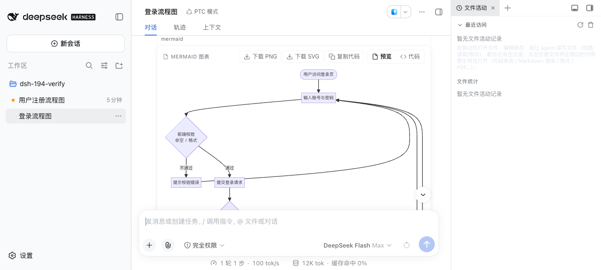
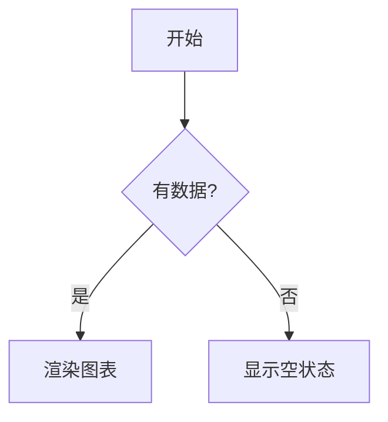

# dsh-mermaid-render

[](https://github.com/topics/dsh)

<div align="center">
  
</div>

**DSH 对话 Mermaid 图表渲染插件**：把对话消息里的 `mermaid` / `mmd` 代码块自动渲染成**图表卡片**（预览 / 代码切换），**mermaid 引擎内联打包、完全离线**，不依赖任何 CDN。

## 功能

- **自动渲染**：对话中（assistant 与 user 消息）的 `\`\`\`mermaid`/`\`\`\`mmd` 代码块自动变成图表卡片，无需手动操作。
- **默认提示模型主动画图**（issue #194）：host 半默认向系统提示词注入一段简短能力说明——「本环境原生支持 mermaid 图表渲染」+ 围栏写法与常见易错点；因此用户**不写出 "mermaid" 字样**（例如只说「画一个登录流程图」）时，模型也会主动输出 mermaid 代码块。可用配置 `injectPrompt: false` 关闭（见[配置](#配置)）。
- **预览 / 代码切换**：卡片右上角可切换「预览」（渲染的 SVG 图）与「代码」（原始 mermaid 源码）。
- **图表导出**（issue #85）：卡片工具栏可**下载 PNG**（SVG → canvas 2x 缩放，清晰度有保障）、**下载 SVG**（矢量原图）、**复制代码**（一键复制 mermaid 源码）；导出失败在卡片内提示，不静默。
- **离线可用**：mermaid 引擎（`mermaid.min.js` UMD）在构建时**内联进 client bundle**，页面加载即用，**零 CDN 依赖**——网络被墙/离线环境也能渲染。
- **失败兜底**：渲染失败时保留原始代码块，并在卡片内显示错误横幅（含具体错误信息）。
- **流式兼容且稳健**：MutationObserver 跟随消息流式渲染；流式中的 mermaid 块会等到内容稳定（流式结束）再渲染，避免把流式中间态的残缺内容渲染成失败卡片；
- **主题一致**：卡片样式走 DSH 语义 token（`--dsw-alias-*` / `--dsw-font-*`），深浅主题自适应。

<div align="center">
  
</div>

## 工作原理

- **Client 端**（`lib/client.js`）：扫描 `[data-conversation-scroll]` 容器内的 `div.md-code-block`（DSH 内置渲染器与 dsh-think-zh-expand 都产出该结构），检查内部 `code.language-mermaid` / `code.language-mmd` 识别 mermaid 块；命中后隐藏原始 `<pre>`，挂载 React 卡片组件，用内联的 mermaid 引擎渲染 SVG。
- **构建**（`scripts/build.mjs`）：把 `vendor/mermaid.min.js`（3.3MB 自包含 UMD）**base64 编码**注入 `lib/client.src.js` 的占位符，生成 `lib/client.js`（DSH 实际服务的文件）。base64 注入避免 JSON 字符串字面量被压缩源码里的控制字符破坏。
- **Server 端**（`lib/index.js` + `lib/prompt.js`）：注册一条 system-prompt section（`name: dsh-mermaid-render`，`order: 100`，排在**用户自定义 persona（0）之后**、策略/工具段（≥ 500）之前），文案固定在 `src/prompt.ts`——**只增不改**，不覆盖用户自定义系统提示词，也不干扰其它插件的 section（宿主按 name 去重、按 order 拼接）。文案有硬性长度上限（500 字符，单测钉住）；`injectPrompt: false` 时不注册任何 section。

## 安装

> 💡 **npm 安装（普通用户推荐）**：`dsh plugin --profile web add dsh-mermaid-render --trust-lockfile`——无需克隆本仓库；以下 link 方式供本仓库开发者使用。

```sh
# 1) 克隆本仓库（任意目录）
git clone https://github.com/baosfeng/my-dsh-plugins.git
# 2) 以本地 link 方式安装（将 <仓库路径> 替换为上面的克隆目录）
dsh plugin --profile web add link:<仓库路径>/plugins/dsh-mermaid-render
```

装完后**重启 `dsh web`**（bundle 层在启动时组合），再硬刷新浏览器（Cmd/Ctrl+Shift+R）。

> 与 [dsh-think-zh-expand](../dsh-think-zh-expand/README.md) 配合：该插件替换消息渲染器后仍产出 `md-code-block` 结构，本插件可直接识别渲染。

## 使用

发送包含 mermaid 代码块的消息即可：

````markdown

````

代码块会自动变成图表卡片（右上角可切换 预览 / 代码）。

## 开发

```sh
# 修改 lib/client.src.js 后重新构建（注入 mermaid 引擎）
npm run build

# 运行测试（client 渲染路径 + host 注入 + 构建门禁 + Gherkin 验收）
npm test
```

> `lib/client.js` 是构建产物，**必须提交**（CI 只跑 `node --check` + 测试，不执行构建）。

### 构建门禁（issue #185）

`scripts/build.mjs` 的两处注入都走 `scripts/splice.mjs` 的 `spliceExactlyOnce`：要求占位符
**恰好一处**，0 处与 ≥2 处都直接抛错（不再用 `replaceAll` 静默全替换）。注入引擎后还会用
`readAssignedStringLiteral` 断言**产物里常量的取值**等于注入的 base64 —— "占位符已替换"不等于
"引擎可用"（占位符曾落在块注释里，替换成功而取值恒为空串，内联引擎永远加载不了）。回归测试
`test/build-inject.mjs` 钉住四条底线：

- `lib/client.src.js` 模板（含注释）不得出现引擎占位符字面量；
- 产物 `lib/client.js` 里引擎 base64 恰好一份、体积 < 6 MB（单份引擎实测 4.49 MB）；
- 产物内 `MERMAID_UMD_B64` 是字符串字面量、取值 === vendor 引擎 base64，解码后逐字节一致；
- `spliceExactlyOnce` 对 0 处 / 2 处显式失败，只有恰好 1 处才写入。

产物含一条 4.45 MB 单行（base64 内联引擎），已被 `.prettierignore`、`eslint.config.js`、
`.jscpd.json` 排除；全仓扫描类门禁（`scripts/check-links.mjs`）靠「路径排除 + >1MB 文件 + >100k 字符单行」三重防护在 0.2 秒内扫完 883 个文件，见

> [docs/踩坑/超长单行让全仓正则扫描挂死.md](../../docs/踩坑/超长单行让全仓正则扫描挂死.md)。

## 已知限制

- 卡片为「预览 / 代码」两态，暂无缩放 / 全屏（需要可后续加）。
- mermaid 引擎体积较大（内联后 client.js 约 4.4MB），本地加载可接受；首次解析约 1-2 秒。
- 注入的能力说明描述的是 **web 端**行为（渲染发生在浏览器里）：host 半无法感知 client 端是否可用，非 web profile（headless / TUI）请用 `injectPrompt: false` 关闭。
- 注入文案目前是**中文**（与 dsh-think-zh-expand / dsh-my-memory 的注入风格一致）；英文环境下的本地化未做。

## 配置

| 配置项         | 类型    | 默认   | 说明                                                                                             |
| -------------- | ------- | ------ | ------------------------------------------------------------------------------------------------ |
| `injectPrompt` | boolean | `true` | 是否向系统提示词注入 mermaid 能力说明（issue #194）。**仅显式 `false` 关闭**（非法值按默认开）。 |

关闭后：不再注册 system-prompt section，**client 端渲染不受影响**（模型对已有的 mermaid 代码块照常渲染，只是不再被主动引导）。写法（写进 profile 的 `cordis.patch.yml`，改完重启 `dsh web`）：

```yaml
- id: mermaid-render
  config:
    injectPrompt: false
```

> 非 web 端 profile（如 headless / TUI，没有客户端渲染面）建议关掉注入——那里模型输出 mermaid 代码块不会变成图表。

## 依赖

| 依赖                             | 用途                                                                    | 可选                                                   |
| -------------------------------- | ----------------------------------------------------------------------- | ------------------------------------------------------ |
| `cordis`                         | 插件运行时                                                              | 是（宿主提供）                                         |
| `@deepseek-ai/dsh-system-prompt` | 系统提示词 section 注册（issue #194 注入）                              | 是（宿主提供；缺失/未加载时跳过注入，client 渲染照常） |
| `dsh-think-zh-expand`            | 其替换渲染器后仍产出 `md-code-block` 结构，本插件可直接识别（无需依赖） | 是（可配合）                                           |

## 相关文档

→ [mermaid 渲染模块文档](../../docs/mermaid渲染/概述.md) · [需求清单](../../docs/mermaid渲染/需求清单.md) · [CHANGELOG](CHANGELOG.md)
