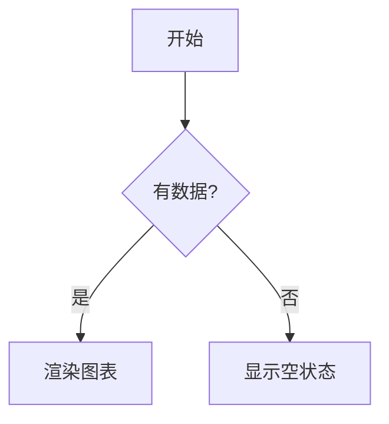

# dsh-mermaid-render

[](https://github.com/topics/dsh)

<div align="center">
  
</div>

**DSH 对话 Mermaid 图表渲染插件**：把对话消息里的 `mermaid` / `mmd` 代码块自动渲染成**图表卡片**（预览 / 代码切换），**mermaid 引擎内联打包、完全离线**，不依赖任何 CDN。

## 功能

- **自动渲染**：对话中（assistant 与 user 消息）的 `\`\`\`mermaid`/`\`\`\`mmd` 代码块自动变成图表卡片，无需手动操作。
- **预览 / 代码切换**：卡片右上角可切换「预览」（渲染的 SVG 图）与「代码」（原始 mermaid 源码）。
- **图表导出**（issue #85）：卡片工具栏可**下载 PNG**（SVG → canvas 2x 缩放，清晰度有保障）、**下载 SVG**（矢量原图）、**复制代码**（一键复制 mermaid 源码）；导出失败在卡片内提示，不静默。
- **离线可用**：mermaid 引擎（`mermaid.min.js` UMD）在构建时**内联进 client bundle**，页面加载即用，**零 CDN 依赖**——网络被墙/离线环境也能渲染。
- **失败兜底**：渲染失败时保留原始代码块，并在卡片内显示错误横幅（含具体错误信息）。
- **流式兼容且稳健**：MutationObserver 跟随消息流式渲染；流式中的 mermaid 块会等到内容稳定（流式结束）再渲染，避免把流式中间态的残缺内容渲染成失败卡片；
- **主题一致**：卡片样式走 DSH 语义 token（`--dsw-alias-*` / `--dsw-font-*`），深浅主题自适应。

## 工作原理

- **Client 端**（`lib/client.js`）：扫描 `[data-conversation-scroll]` 容器内的 `div.md-code-block`（DSH 内置渲染器与 dsh-think-zh-expand 都产出该结构），检查内部 `code.language-mermaid` / `code.language-mmd` 识别 mermaid 块；命中后隐藏原始 `<pre>`，挂载 React 卡片组件，用内联的 mermaid 引擎渲染 SVG。
- **构建**（`scripts/build.mjs`）：把 `vendor/mermaid.min.js`（3.3MB 自包含 UMD）**base64 编码**注入 `lib/client.src.js` 的占位符，生成 `lib/client.js`（DSH 实际服务的文件）。base64 注入避免 JSON 字符串字面量被压缩源码里的控制字符破坏。
- **Server 端**（`lib/index.js`）：空壳（纯 client 插件，无 host 逻辑）。

## 安装

> 💡 **npm 安装（普通用户推荐）**：`dsh plugin --profile web add dsh-mermaid-render --trust-lockfile`——无需克隆本仓库；以下 link 方式供本仓库开发者使用。

```sh
# 1) 克隆本仓库（任意目录）
git clone https://github.com/baosfeng/my-dsh-plugins.git
# 2) 以本地 link 方式安装（将 <仓库路径> 替换为上面的克隆目录）
dsh plugin --profile web add link:<仓库路径>/plugins/dsh-mermaid-render
```

装完后**重启 `dsh web`**（bundle 层在启动时组合），再硬刷新浏览器（Cmd/Ctrl+Shift+R）。

> 与 [dsh-think-zh-expand](../dsh-think-zh-expand/README.md) 配合：该插件替换消息渲染器后仍产出 `md-code-block` 结构，本插件可直接识别渲染。

## 使用

发送包含 mermaid 代码块的消息即可：

````markdown

````

代码块会自动变成图表卡片（右上角可切换 预览 / 代码）。

## 开发

```sh
# 修改 lib/client.src.js 后重新构建（注入 mermaid 引擎）
npm run build

# 运行测试（client 渲染路径 + 扫描逻辑）
npm test
```

> `lib/client.js` 是构建产物，**必须提交**（CI 只跑 `node --check` + 测试，不执行构建）。

### 构建门禁（issue #185）

`scripts/build.mjs` 的两处注入都走 `scripts/splice.mjs` 的 `spliceExactlyOnce`：要求占位符
**恰好一处**，0 处与 ≥2 处都直接抛错（不再用 `replaceAll` 静默全替换）。注入引擎后还会用
`readAssignedStringLiteral` 断言**产物里常量的取值**等于注入的 base64 —— "占位符已替换"不等于
"引擎可用"（占位符曾落在块注释里，替换成功而取值恒为空串，内联引擎永远加载不了）。回归测试
`test/build-inject.mjs` 钉住四条底线：

- `lib/client.src.js` 模板（含注释）不得出现引擎占位符字面量；
- 产物 `lib/client.js` 里引擎 base64 恰好一份、体积 < 6 MB（单份引擎实测 4.49 MB）；
- 产物内 `MERMAID_UMD_B64` 是字符串字面量、取值 === vendor 引擎 base64，解码后逐字节一致；
- `spliceExactlyOnce` 对 0 处 / 2 处显式失败，只有恰好 1 处才写入。

产物含一条 4.45 MB 单行（base64 内联引擎），已被 `.prettierignore`、`eslint.config.js`、
`.jscpd.json` 排除；全仓扫描类门禁（`scripts/check-links.mjs`）靠"路径排除 + >1MB 文件 +

> 100k 字符单行"三重防护在 0.2 秒内扫完 883 个文件，见
> [docs/踩坑/超长单行让全仓正则扫描挂死.md](../../docs/踩坑/超长单行让全仓正则扫描挂死.md)。

## 已知限制

- 卡片为「预览 / 代码」两态，暂无缩放 / 全屏（需要可后续加）。
- mermaid 引擎体积较大（内联后 client.js 约 4.4MB），本地加载可接受；首次解析约 1-2 秒。

## 配置

无配置项。插件激活即生效。

## 依赖

| 依赖                  | 用途                                                                    | 可选           |
| --------------------- | ----------------------------------------------------------------------- | -------------- |
| `cordis`              | 插件运行时                                                              | 是（宿主提供） |
| `dsh-think-zh-expand` | 其替换渲染器后仍产出 `md-code-block` 结构，本插件可直接识别（无需依赖） | 是（可配合）   |

## 相关文档

→ [mermaid 渲染模块文档](../../docs/mermaid渲染/概述.md) · [需求清单](../../docs/mermaid渲染/需求清单.md) · [CHANGELOG](CHANGELOG.md)
