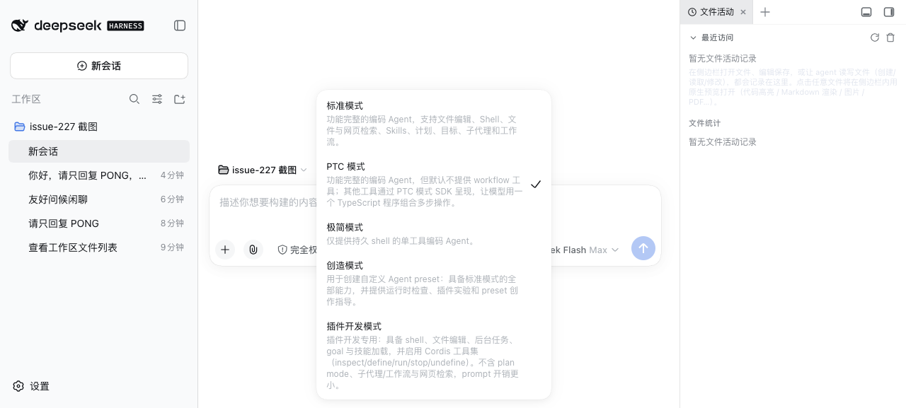

# dsh-plugin-dev-mode

[](https://github.com/topics/dsh-agent-presets)

<div align="center">
  
</div>

**DSH 插件开发模式**：一个 agent preset 资产包。它向 DSH 提供一个名为「插件开发模式」（`plugin-dev`）的 Agent 预设——**唯一启用 Cordis 工具集**（`cordis_inspect_*` / `cordis_define` / `cordis_run` / `cordis_stop` / `cordis_undefine`）的模式，用于开发、调试和维护 DSH 插件与动态 Cordis 插件。

> 这不是运行时插件（无需挂载到 profile），而是 Agent preset 配置资产：安装后可在 DSH Web 的模式选择器中切换使用。

## 功能

1. **Cordis 工具集**：`cordis_inspect_list/query/self`（运行时检查）+ `cordis_define/run/stop/undefine`（动态插件生命周期管理），外加 `@pluginId` 上下文注入支持。
2. **精简工具组合**：shell（bash/pwsh）、文件（read/write/edit/glob/grep）、后台任务、goal、ask、todo、技能加载（`tool-skill`）+ compaction——开发插件所需的能力一应俱全。
3. **自带技能**：`editing-cordis-compositions`（组合编辑规范）与 `cordis-plugin-development`（动态插件开发规范）随 preset 目录安装。
4. **省 token**：与 shipped「创造模式」相比，去掉了 plan mode（约 110 行常驻 section）、subagent/workflow/ralph 全套委派工具、web 搜索——prompt 开销显著更小。

### 与其他模式的对比

| 模式                           | Cordis 工具集 | plan mode | 子代理/工作流 | web 搜索 | 说明                              |
| ------------------------------ | ------------- | --------- | ------------- | -------- | --------------------------------- |
| 标准模式（standard）           | ❌            | ✅        | ✅            | ✅       | 功能完整的编码 Agent（日常默认）  |
| 创造模式（cordis）             | ✅            | ✅        | ✅            | ✅       | shipped，与本文模式**同进程互斥** |
| 极简模式（minimal）            | ❌            | ❌        | ❌            | ❌       | 双工具极简 Agent                  |
| **插件开发模式（plugin-dev）** | ✅            | ❌        | ❌            | ❌       | 本包提供，插件开发专用            |

## 工作原理

- **`agent.cordis.yml`**：预设组合文件。保留 `standard` 中插件开发所需行（shell / filesystem / jobs / goal / compaction / skills / ask / todo），并追加 `@deepseek-ai/dsh-tool-cordis` 工具集；删除 plan mode、delegation（subagent/workflow/ralph）、web 三组高 token 成本项。
- **`preset.yml`**：预设显示元数据（名称「插件开发模式」与描述）。
- **`skills/`**：随 preset 安装的两个技能，经 `skill-filesystem` 的 `customSkillDirs` 以 `baseUrl` 相对解析。
- **`scripts/install.mjs`**：一键复制 preset 到 `$DSH_HOME/.agent-presets/plugin-dev/`（`DSH_HOME` 默认 `~/.dsh`）。

## 安装

```sh
# 方式一：一键安装（推荐）
cd plugins/dsh-plugin-dev-mode
npm run install:preset

# 方式二：手动
mkdir -p ~/.dsh/.agent-presets/plugin-dev
cp agent.cordis.yml preset.yml ~/.dsh/.agent-presets/plugin-dev/
cp -R skills ~/.dsh/.agent-presets/plugin-dev/
```

装完后**重启 DSH 进程**（preset 在进程启动时读取），然后在 Web GUI 的模式选择器中切换到「插件开发模式」。

## 注意事项

- **与「创造模式」（shipped cordis）同进程互斥**：`dsh-tool-cordis` 的 inspect 注册表是进程级单例，同一进程内只能有一个 preset 挂载它。日常使用「标准模式」+ 开发时切换本模式即可，**不要同时开启两个带 Cordis 工具集的模式会话**。
- **默认模式**：建议将 `~/.dsh/settings.yaml` 的 `agent-presets.default` 设为 `standard`，让日常会话不带 Cordis 工具集，进一步省 token：

  ```yaml
  agent-presets:
    default: standard
  ```

- 本包不发布 npm，也不注册到 profile——它是 Agent preset 资产，安装即复制文件。

## 卸载

```sh
rm -rf ~/.dsh/.agent-presets/plugin-dev
```

重启 DSH 进程后，「插件开发模式」从选择器中消失。
