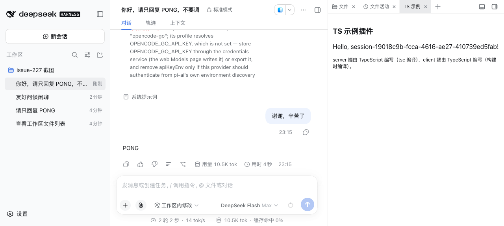

# dsh-session-title-gen

[](https://github.com/topics/dsh)

<div align="center">
  
</div>

**DSH 会话标题自动生成插件**：监听会话首条人类消息，用 LLM 生成类似 git commit 的**结构化标题**——先标明当前会话属于哪个工作区（项目），再写一段简要描述，如 `[my-dsh-plugins] 修复记忆页签崩溃`。会话列表一眼可辨归属与主题。

## 功能

- **结构化标题自动生成**：首条人类消息后生成 `[工作区名] 简要描述`；工作区名 = 会话工作目录的项目根 basename，描述由 LLM 生成（system prompt 强制单行格式，语言跟随消息）。
- **重启后标题保留**：经 DSH 核心 `session/title` 事件（log-backed）写入，DSH 原生会话列表与 observability 面板均显示新标题。
- **失败静默回退**：LLM 不可用 / 超时 / 输出为空时不阻塞会话，核心标题机制照常工作。
- **与核心标题机制协作**：不注册标题 provider，直接 append `session/title` 事件覆盖；核心生成的非结构化标题（fallback / provider）会触发本插件重新生成；用户手动重命名的标题（source: user）不被覆盖。

## 配置

| 配置项                              | 默认值                        | 说明                                      |
| ----------------------------------- | ----------------------------- | ----------------------------------------- |
| `enabled`                           | `true`                        | 总开关（`false` 完全关闭，不监听事件）    |
| `template`                          | `[{workspace}] {description}` | 标题格式模板（两个占位符）                |
| `provider` / `model`                | 缺省                          | LLM provider / model 覆盖                 |
| `maxTitleBytes`                     | `80`                          | 标题 UTF-8 字节上限                       |
| `maxInputBytes` / `maxOutputTokens` | `4096` / `64`                 | 送入 LLM 的消息字节上限 / 输出 token 上限 |
| `timeoutMs`                         | `30000`                       | LLM 调用超时（超时静默回退）              |

配置写在 profile 的 `cordis.patch.yml`：

```yaml
- id: session-title-gen
  config:
    enabled: true
    template: '[{workspace}] {description}'
```

## 安装

```bash
# npm 安装（推荐）
dsh plugin --profile web add dsh-session-title-gen --trust-lockfile

# 本地 link（本仓库开发者）
git clone https://github.com/baosfeng/my-dsh-plugins.git
dsh plugin --profile web add link:<仓库路径>/plugins/dsh-session-title-gen
```

## 相关文档

→ [会话标题自动生成概述](../../docs/会话标题自动生成/概述.md)

## License

MIT
