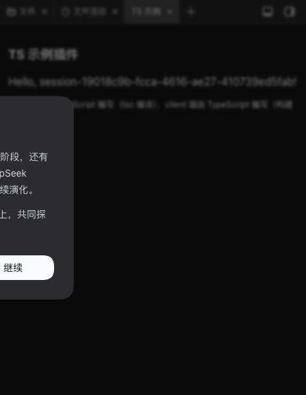

# dsh-ts-example

[](https://github.com/topics/dsh)

<div align="center">
  
</div>

**DSH 插件 TypeScript 开发示例插件**（issue #47）：演示新插件用 TypeScript 开发的全流程——server 端 TS 源码 + `tsc` 编译（`lib/index.js` 产物）、client 端 TS 源码 + 构建时编译（`__ModuleLoader__` bundle），编译期即可发现模块不存在（TS2307）、类型不匹配、未定义变量等错误。

## 功能

- **问候语路由**：`GET /ts-example/api/greeting?name=xxx` → `{ "greeting": "Hello, xxx!" }`（支持 `zh` / `en` 语言配置）；
- **会话计数**：`GET /ts-example/api/stats` → `{ "sessions": N }`（监听 `session/start` 事件计数）；
- **侧边栏页签「TS 示例」**：显示当前会话的问候语（client 端 TS → server 端 TS 全链路）。

## TypeScript 开发说明（本插件即模板）

| 端     | 源码                                                                   | 构建                                                                        | 产物                    |
| ------ | ---------------------------------------------------------------------- | --------------------------------------------------------------------------- | ----------------------- |
| Server | `src/*.ts`（`index.ts` 入口 + `greeting.ts` 逻辑 + `types.d.ts` 类型） | `npx tsc -p tsconfig.json`（nodenext → ESM）                                | `lib/index.js`（提交）  |
| Client | `src/client/index.ts`（单文件，`import type` 可拆类型文件）            | `npx tsc -p tsconfig.client.json`（commonjs）+ `scripts/build.mjs` 注入模板 | `lib/client.js`（提交） |

- 类型检查：根目录 `tsconfig.json`（strict）+ `npm run typecheck`（即 `tsc --noEmit`，CI 强制）；
- 产物必须提交（CI 只跑 `node --check` + 测试，不跑构建）；改动 TS 源码后运行 `npm run build` 重新生成产物；
- 完整开发说明见 [docs/TS示例/概述.md](../../docs/TS示例/概述.md) 与插件开发技能（`skills/dsh-plugin-development/SKILL.md`）。

## 安装

```bash
# 方式一：npm（GitHub Release 发布后可用）
dsh plugin --profile web add dsh-ts-example --trust-lockfile

# 方式二：本地 link（开发调试）
git clone https://github.com/baosfeng/my-dsh-plugins.git
dsh plugin --profile web add link:<仓库路径>/plugins/dsh-ts-example
```

## 配置

| 配置项     | 类型           | 默认值 | 说明       |
| ---------- | -------------- | ------ | ---------- |
| `language` | `'zh' \| 'en'` | `'en'` | 问候语语言 |

## 开发

```bash
npm run build      # 编译 server（tsc）+ client（tsc + 模板注入）
npm run typecheck  # 插件内类型检查（tsc --noEmit × 2）
npm test           # 单元测试 + 覆盖率门禁
```
